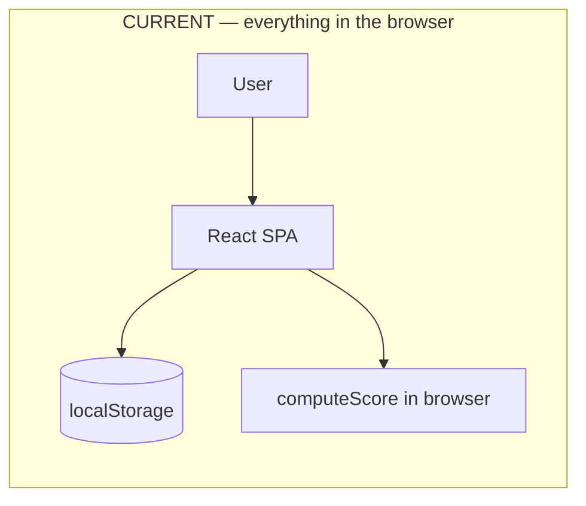
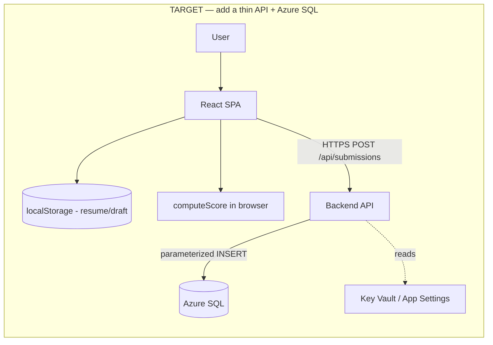

# Azure SQL Integration & Hosting — Developer Handoff

> **Audience:** The developer who will connect this survey app to **Microsoft Azure SQL** and **host it on Azure**.
> **Status of this document:** Living handoff guide. It describes the current app as-is and the recommended path forward. No application code has been changed to produce this guide.
> **Supersedes:** [HUBSPOT-INTEGRATION.md](HUBSPOT-INTEGRATION.md). The HubSpot plan was never implemented and is replaced by the Azure SQL approach described here.

---

## 1. Executive summary

This is a **100% client-side** React + TypeScript + Vite single-page application (SPA). A respondent answers 32 questions; the app scores the answers **in the browser** and shows a maturity level on a summary screen. **There is currently no backend, no database, no API calls, and no server-side secrets.** All state lives in the browser's `localStorage`.

Your job has two parts:

1. **Persist each completed submission to Azure SQL.** Because a browser must never hold a database connection string or talk to SQL directly, you will add a **thin backend API** that the SPA calls with the finished submission. The API validates the payload and writes one row to Azure SQL.
2. **Host the app on Azure.** The SPA is a static bundle (`npm run build` → `dist/`). The backend is a small HTTP endpoint. Recommended hosting options are documented in [§9](#9-hosting-options).

Nothing about the survey questions, scoring, or UI needs to change to add persistence. The single integration point is described in [§5](#5-the-single-frontend-integration-point).

### Current vs. target architecture





Key idea: **localStorage stays** (it powers resume/draft while a user is mid-survey). Azure SQL is a **new, additional** destination that receives the final submission when the survey is completed.

---

## 2. Why a backend is required

You cannot connect the browser directly to Azure SQL. A backend API sits between them for three reasons:

- **Secrets stay server-side.** The Azure SQL connection string (or managed identity) must never ship in client JavaScript — anything in the browser bundle is public.
- **Validation & integrity.** The API validates and shapes the payload before writing, and uses **parameterized queries** to prevent SQL injection.
- **Network reality.** Azure SQL speaks the TDS protocol over port 1433, not something a browser `fetch` can use. A browser can only make HTTP(S) requests.

The backend is intentionally **small**: one endpoint that accepts a completed submission and inserts one row.

---

## 3. Current data flow (what exists today)

| Stage | Where | What happens |
|---|---|---|
| Answer capture | [../src/state/AnswersContext.tsx](../src/state/AnswersContext.tsx) | React Context holds the `answers` map (`q1`…`q32`), `lastQuestionIndex`, and `seenFacts`. `setAnswer()` updates one question. |
| Persistence (resume) | [../src/lib/storage.ts](../src/lib/storage.ts) | Every change is saved to `localStorage` under key `ai-survey-answers-v1` as `{ answers, lastQuestionIndex }`. `seenFacts` lives in `sessionStorage`. |
| Question rendering | [../src/pages/QuestionPage.tsx](../src/pages/QuestionPage.tsx) | Renders each question by type and writes answers back into the context. |
| Scoring | [../src/lib/scoring.ts](../src/lib/scoring.ts) → `computeScore(answers)` | Runs entirely client-side. Returns a `ScoreResult`. |
| Results | [../src/pages/SummaryPage.tsx](../src/pages/SummaryPage.tsx) | Calls `computeScore(answers)` on mount (via `useMemo`) and renders the maturity level, numeric score, and benchmark facts. |

There are **no** `fetch`/`axios` calls, `.env` files, or environment variables anywhere except Vite's built-in `import.meta.env.BASE_URL` (used only for asset paths). Confirm at any time with a search for `fetch(`, `axios`, or `import.meta.env`.

### Answer shapes (from [../src/types.ts](../src/types.ts))

Answers are keyed `q1`…`q32`. The value shape depends on the question type:

| Question type | TypeScript type | Runtime shape | Example |
|---|---|---|---|
| `single` | `SingleAnswer = number` | selected option index | `2` |
| `multi` | `MultiAnswer = number[]` | selected option indices | `[0, 3, 5]` |
| `matrix-single` | `MatrixSingleAnswer = Record<number, number>` | rowIndex → colIndex | `{ "0": 1, "1": 2 }` |
| `matrix-column-single` | `MatrixSingleAnswer = Record<number, number>` | colIndex → rowIndex | `{ "0": 3 }` |
| `matrix-multi` | `MatrixMultiAnswer = string[]` | `"rowIndex:colIndex"` keys | `["0:1", "2:0"]` |

The full answers object is a `Record<string, AnswerValue>` (`AnswersMap`). It is safe to serialize directly as JSON — **you do not need to flatten or transform it** to store it (see the schema in [§6](#6-proposed-azure-sql-schema)).

### Scoring output (`ScoreResult` from [../src/lib/scoring.ts](../src/lib/scoring.ts))

```ts
interface ScoreResult {
  average: number;                     // 1.0–5.0; 0 means no scoreable answers
  count: number;                       // number of scoreable items in the average
  level: MaturityLevel;                // resolved maturity level (see below)
  facts: Fact[];                       // benchmark facts shown on the summary
  perQuestion: Record<number, number>; // per-question average (debug)
}
```

`MaturityLevel` (from [../src/data/levels.ts](../src/data/levels.ts)) has `id` (1–5), `nameEn`, `nameHe`, and an inclusive score `range`:

| Level id | nameEn | Score range |
|---|---|---|
| 1 | Level 1 - Exploring | 1.00 – 1.80 |
| 2 | Level 2 - Experimenting | 1.81 – 2.60 |
| 3 | Level 3 - Scaling | 2.61 – 3.40 |
| 4 | Level 4 - Operationalizing | 3.41 – 4.20 |
| 5 | Level 5 - AI-First Enterprise | 4.21 – 5.00 |

For persistence you only need `average` (the numeric score) and `level.id` + `level.nameEn`. Everything else is derivable and doesn't need to be stored.

---

## 4. What to store per submission

Per the product decision, each **completed** submission should persist:

- **All 32 answers** — store the raw `answers` JSON as-is.
- **Computed score + maturity level** — `average` (decimal) and `level.id` (1–5) plus `level.nameEn` for readability.
- **Completion timestamp** — when the survey was completed (server time is the source of truth; a client timestamp may also be sent).
- **Analytics metadata** — device/user-agent, referrer, and time spent. ⚠️ **These are not collected today** — see [§11](#11-analytics-metadata-not-yet-collected) for what needs to be added.

Submissions are **anonymous** — no email/name/company capture is in scope. If lead capture is added later, extend the schema with nullable contact columns.

---

## 5. The single frontend integration point

Only **one** place in the SPA needs a new call: the moment the survey is completed and the summary is shown.

- **File:** [../src/pages/SummaryPage.tsx](../src/pages/SummaryPage.tsx)
- **Anchor:** the component already computes the result:
  ```ts
  const result = useMemo(() => computeScore(answers), [answers]);
  ```
- **What to add (conceptually):** in an effect that runs once when the summary mounts with a completed survey, POST the payload from [§7](#7-backend-api-contract) to `/api/submissions`. Guard against double submission (e.g., a "submitted" flag in `localStorage`/context) because React Strict Mode and the summary route can re-mount.

**Recommendations for whoever implements the call:**
- Keep the network call **non-blocking** for the UI — the user should still see their result even if the POST fails; queue/retry or log failures.
- Consider a small submission-state field in [../src/state/AnswersContext.tsx](../src/state/AnswersContext.tsx) (e.g., `submittedAt`) so a resumed/refreshed summary doesn't insert duplicate rows.
- Because routing uses `HashRouter`, the summary URL looks like `/#/summary`. That does not affect API calls but is relevant to hosting redirects (see [§9](#9-hosting-options)).

> This document intentionally does **not** add the code. It defines the contract so the integration can be implemented consistently.

---

## 6. Proposed Azure SQL schema

A single table is sufficient. The raw answers are stored as JSON in an `NVARCHAR(MAX)` column (Azure SQL supports `JSON_VALUE`/`ISJSON` for querying), while the fields you'll filter/aggregate on are promoted to real columns.

```sql
CREATE TABLE dbo.SurveySubmissions (
    Id                  UNIQUEIDENTIFIER    NOT NULL CONSTRAINT PK_SurveySubmissions PRIMARY KEY DEFAULT NEWID(),

    -- Scoring
    ScoreAverage        DECIMAL(3,2)        NOT NULL,   -- 1.00–5.00
    ScoreCount          INT                 NOT NULL,   -- scoreable items in the average
    MaturityLevelId     TINYINT             NOT NULL,   -- 1–5
    MaturityLevelName   NVARCHAR(64)        NOT NULL,   -- e.g. 'Level 3 - Scaling'

    -- Raw answers (q1..q32) exactly as produced by the client
    AnswersJson         NVARCHAR(MAX)       NOT NULL CONSTRAINT CK_AnswersJson_IsJson CHECK (ISJSON(AnswersJson) = 1),

    -- Timing
    CompletedAtClient   DATETIME2(3)        NULL,       -- optional client-reported completion time (UTC)
    DurationMs          BIGINT              NULL,        -- time spent in survey (ms)

    -- Analytics metadata
    UserAgent           NVARCHAR(512)       NULL,
    Referrer            NVARCHAR(1024)      NULL,
    Locale              NVARCHAR(16)        NULL,       -- e.g. 'he-IL'

    -- Server-side audit
    CreatedAtUtc        DATETIME2(3)        NOT NULL CONSTRAINT DF_CreatedAtUtc DEFAULT SYSUTCDATETIME(),
    IpHash              VARBINARY(32)       NULL        -- optional: hash of client IP, NEVER the raw IP
);

CREATE INDEX IX_SurveySubmissions_CreatedAtUtc ON dbo.SurveySubmissions (CreatedAtUtc);
CREATE INDEX IX_SurveySubmissions_MaturityLevelId ON dbo.SurveySubmissions (MaturityLevelId);
```

**Notes**
- `AnswersJson` holds the full `answers` object (`{"q1":2,"q7":{"0":1,"1":2},"q14":["0:1"]}`). Keep it verbatim so re-scoring or analysis remains possible.
- Store `IpHash` only if you need abuse/dedup protection, and hash it (e.g., SHA-256) — do not store raw IPs (privacy).
- If you later need heavy per-question analytics, add a normalized child table `SubmissionAnswers(SubmissionId, QuestionKey, ValueJson)`; not required for the current scope.

---

## 7. Backend API contract

One endpoint. Keep it minimal and validate everything.

### `POST /api/submissions`

**Request body (JSON):**
```jsonc
{
  "answers": { "q1": 2, "q7": { "0": 1, "1": 2 }, "q14": ["0:1"] },
  "score": {
    "average": 3.24,
    "count": 17,
    "levelId": 3,
    "levelName": "Level 3 - Scaling"
  },
  "meta": {
    "completedAtClient": "2026-07-07T09:12:33.000Z",
    "durationMs": 254000,
    "userAgent": "Mozilla/5.0 ...",
    "referrer": "https://example.com/landing",
    "locale": "he-IL"
  }
}
```

**Server responsibilities:**
1. Validate: `answers` is an object; `score.average` is a number in `[0, 5]`; `levelId` in `1..5`. Reject otherwise with `400`.
2. Do **not** trust the client score blindly for analytics-critical use — optionally recompute server-side later, but for now storing the client score is acceptable given scoring is deterministic.
3. Insert one row using a **parameterized query** (never string concatenation).
4. Set `CreatedAtUtc` server-side.

**Responses:**
| Status | Meaning |
|---|---|
| `201 Created` | Row inserted. Body: `{ "id": "<uuid>" }`. |
| `400 Bad Request` | Validation failed. |
| `429 Too Many Requests` | Rate limit tripped (recommended). |
| `500 Internal Server Error` | Unexpected failure (log server-side; don't leak details). |

**CORS:** allow only the SPA's origin(s) — the deployed site URL and, for local dev, `http://localhost:5173`. If you use Azure Static Web Apps with a co-located `api/`, calls are same-origin and CORS is a non-issue.

---

## 8. Backend stack options

The stack is **left to you**; requirements are the same regardless of choice: HTTPS endpoint, JSON body parsing, input validation, parameterized Azure SQL insert, secrets from config, CORS, rate limiting.

| Option | Pros | Cons | Notes |
|---|---|---|---|
| **Azure Functions (Node/TypeScript)** — recommended | Serverless, cheapest at low volume, integrates natively with **Azure Static Web Apps** (drop an `api/` folder), same TS language as the SPA, easy managed identity to SQL | Cold starts on consumption plan | Use `mssql` (tedious) driver or `@azure/identity` + managed identity |
| **.NET (C#) Web API** | First-class Azure/SQL tooling, `Microsoft.Data.SqlClient`, EF Core, strong enterprise fit | Separate language/toolchain from the SPA | Good if the team is a Microsoft shop |
| **Node/Express server** | Familiar, flexible, portable | You manage hosting, scaling, and TLS termination yourself | Deploy to Azure App Service or a container |

**Driver/connection guidance (any stack):**
- Prefer **Azure AD / Managed Identity** over SQL username+password so no secret is stored at all.
- If using a connection string, store it in **Azure Key Vault** or the hosting platform's application settings — never in source control.
- Enable **connection pooling** and set sensible timeouts.

---

## 9. Hosting options

The frontend is a static bundle; the backend is a small API. Two Azure-native shapes fit well.

### Option A — Azure Static Web Apps (recommended)
- Hosts the built SPA (`dist/`) on a global CDN **and** an integrated **Azure Functions** API under `/api/*` in the same deployment.
- Same-origin API calls → **no CORS** setup.
- Free/low-cost tiers; built-in GitHub Actions deployment; easy custom domains + TLS.
- SPA fallback routing is configured via `staticwebapp.config.json` (route all non-file, non-`/api` paths to `index.html`). This app uses `HashRouter`, so deep-link fallback is minimal, but still add the config for `/api` routing and headers.

### Option B — Azure App Service
- Single service can serve the static files and host the API (Node/.NET).
- Good if you want one deployable unit or need always-on (no cold starts).
- You configure CORS if the API and SPA are on different origins; app settings hold the connection string; managed identity can reach Azure SQL.

### Frontend build specifics (applies to any host)
- **Build:** `npm run build` (runs `tsc -b` then `vite build`) → outputs to `dist/`.
- **Base path:** [../vite.config.ts](../vite.config.ts) currently sets `base: '/AI-survey-2026/'` for production builds (a GitHub Pages sub-path). **On Azure you will almost certainly serve from the domain root**, so change the production `base` to `'/'` (or your actual sub-path). If this is wrong, assets 404.
- **Routing:** `HashRouter` (see [../src/main.tsx](../src/main.tsx)) means URLs are like `/#/summary`; the server only ever serves `index.html`, which simplifies static hosting.
- **Service worker:** PWA is intentionally disabled — [../public/sw.js](../public/sw.js) unregisters and clears caches, and [../src/main.tsx](../src/main.tsx) unregisters any existing SW. Leave as-is unless offline support is wanted.
- **Existing CI/CD:** `.github/workflows/pages.yml` currently deploys to **GitHub Pages**. Replace or add a workflow targeting your chosen Azure host.

---

## 10. Configuration & secrets

| Concern | Recommendation |
|---|---|
| Azure SQL credentials | Use **Managed Identity** (no secret). If not possible, put the connection string in **Key Vault** or app settings. |
| Local dev secrets | Use a local settings file that is git-ignored (e.g., `local.settings.json` for Functions, `.env` for Express). Add a committed `*.example` template with placeholder keys. |
| Frontend config | The SPA needs only the API base URL. With Static Web Apps this is same-origin (`/api`), so no config needed. Otherwise expose it via a Vite env var (`VITE_API_BASE_URL`) at build time — remember Vite only inlines vars prefixed with `VITE_`. |
| Vite base path | Update production `base` in [../vite.config.ts](../vite.config.ts) for the Azure domain (see §9). |

> Reminder: anything prefixed `VITE_` is **embedded in the public bundle**. Never put secrets there — only non-sensitive values like the API URL.

---

## 11. Analytics metadata (not yet collected)

The requested analytics fields are **not captured today** and need small additions on the client before they can be stored:

| Field | Source | Work needed |
|---|---|---|
| Device / user agent | `navigator.userAgent` | Read at submission time. |
| Referrer | `document.referrer` | Read at submission time (may be empty). |
| Locale | `navigator.language` | Read at submission time (expected `he-IL`). |
| Time spent (`durationMs`) | timestamps | Record a **start time** when the survey begins (e.g., on the Welcome page or first answer) and subtract at completion. Persist the start time in `localStorage` so it survives refresh/resume. |

These can be gathered in the same place the submission is sent ([§5](#5-the-single-frontend-integration-point)) and included in the `meta` object of the request body ([§7](#7-backend-api-contract)).

---

## 12. Security checklist

- **SQL injection:** use **parameterized queries / prepared statements** only. Never build SQL by string concatenation.
- **Secrets:** never in the client bundle or source control. Managed Identity preferred; otherwise Key Vault / app settings.
- **CORS:** allowlist the specific SPA origin(s); avoid `*`. (Same-origin with Static Web Apps avoids this entirely.)
- **Rate limiting / abuse:** add per-IP throttling on `POST /api/submissions` (e.g., `429`). Consider a lightweight anti-bot check if the survey is public.
- **Transport:** HTTPS everywhere; Azure SQL connections with encryption enabled (`Encrypt=True`).
- **Input size limits:** cap request body size; validate `answers` keys/shape before insert.
- **Privacy / consent (Israeli market, Hebrew):** submissions are anonymous. If any personal data is added later, ensure lawful-basis/consent, a retention policy, and don't store raw IPs (hash if needed). Document a data-retention period for the table.
- **Least privilege:** the API's SQL principal should have `INSERT` (and only what's needed) on `dbo.SurveySubmissions`, not `db_owner`.
- **Error handling:** log server-side; return generic messages to the client (no stack traces / connection details).

---

## 13. Local development & testing

**Run the SPA locally:**
```bash
npm install
npm run dev          # http://localhost:5173
```

**Existing quality gates (keep them green):**
```bash
npm run lint         # tsc type-check
npm test             # vitest unit tests
npm run coverage     # unit tests + coverage report
npm run e2e          # Playwright end-to-end (auto-starts dev server)
```
Relevant test files already cover scoring and storage: [../src/lib/scoring.test.ts](../src/lib/scoring.test.ts), [../src/lib/storage.test.ts](../src/lib/storage.test.ts), [../src/state/AnswersContext.test.tsx](../src/state/AnswersContext.test.tsx), [../src/pages/flow.test.tsx](../src/pages/flow.test.tsx).

**Local full-stack (recommended for Static Web Apps + Functions):**
- Use the **Azure Static Web Apps CLI** (`swa`) to run the SPA and the `api/` Functions together with same-origin routing, mirroring production.
- Point the local API at a **dev Azure SQL** database (or Azure SQL local emulator / a containerized SQL Server) and run the DDL from [§6](#6-proposed-azure-sql-schema).

**Suggested new tests when you add the integration:**
- Unit-test the API validation and the insert (mock the SQL driver).
- An e2e that completes the survey and asserts the POST fires once with the expected payload shape.

---

## 14. Handoff checklist

- [ ] Provision **Azure SQL** database; run the DDL in [§6](#6-proposed-azure-sql-schema).
- [ ] Choose backend stack ([§8](#8-backend-stack-options)) and hosting shape ([§9](#9-hosting-options)).
- [ ] Implement `POST /api/submissions` per the contract in [§7](#7-backend-api-contract) with parameterized insert.
- [ ] Wire the submission call into [../src/pages/SummaryPage.tsx](../src/pages/SummaryPage.tsx) (single integration point, [§5](#5-the-single-frontend-integration-point)), with double-submit protection.
- [ ] Add analytics capture (start time, UA, referrer, locale) — [§11](#11-analytics-metadata-not-yet-collected).
- [ ] Update production `base` in [../vite.config.ts](../vite.config.ts) for the Azure domain — [§9](#9-hosting-options).
- [ ] Configure secrets via Managed Identity / Key Vault — [§10](#10-configuration--secrets).
- [ ] Set up CORS (or use same-origin Static Web Apps), rate limiting, and HTTPS — [§12](#12-security-checklist).
- [ ] Replace/extend CI/CD to deploy to Azure instead of GitHub Pages.
- [ ] Add tests for the API and the submit flow — [§13](#13-local-development--testing).

### Open questions for the product owner
- Data retention period for `SurveySubmissions`?
- Is any respondent identification (email/company) expected later, or strictly anonymous?
- Expected volume (affects consumption vs. always-on hosting choice)?
- Should the server **recompute** the score for trust, or accept the client-computed value?
